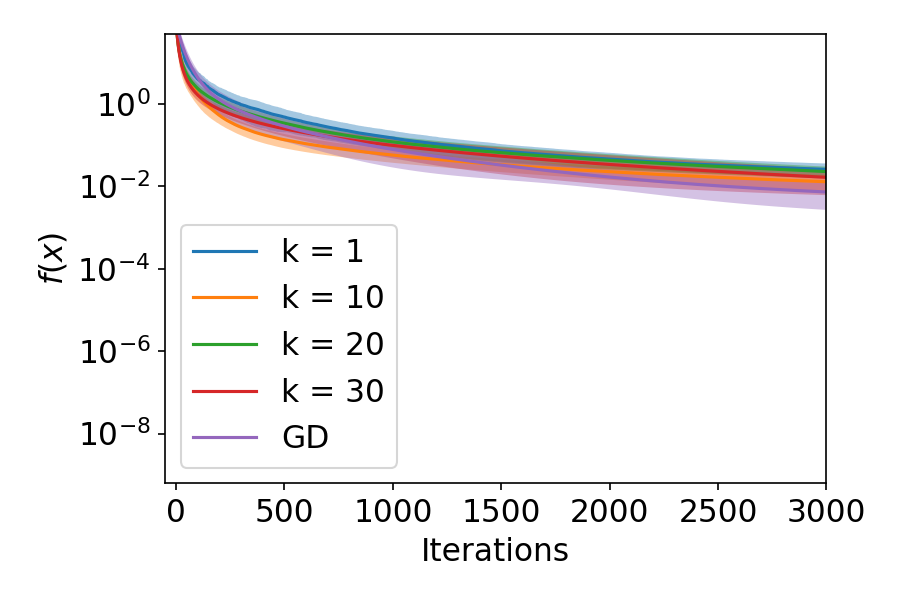

[](https://pubsonline.informs.org/journal/ijoc)

# Convergence Rates of Zeroth-order Gradient Descent (ZGD) for Łojasiewicz Functions

This archive is distributed in association with the [INFORMS Journal on
Computing](https://pubsonline.informs.org/journal/ijoc) under the [MIT License](LICENSE). This is a code repo for experiments in the paper "Convergence Rates of Zeroth-order Gradient Descent for Łojasiewicz Functions'' by Tianyu Wang and Yasong Feng.


The software and data in this repository are a snapshot of the software and data
that were used in the research reported on in the paper 
[Convergence Rates of Zeroth-order Gradient Descent for Łojasiewicz Functions](https://doi.org/) by Tianyu Wang and Yasong Feng. 

**Important: This code is a frozen copy of 
https://github.com/wangt1anyu/code-zeroth-order-Lojasiewicz. Please go there if you would like to
get an author-maintained version or would like support**

## Cite

To cite the contents of this repository, please cite both the paper and this repo, using their respective DOIs.

https://doi.org/10.1287/ijoc.2023.0247

https://doi.org/10.1287/ijoc.2023.0247.cd

Below is the BibTex for citing this snapshot of the respoitory.

```
@article{wf2024loj,
  author =        {Tianyu Wang and Yasong Feng},
  publisher =     {INFORMS Journal on Computing},
  title =         {{Convergence Rates of Zeroth-order Gradient Descent for Łojasiewicz Functions}},
  year =          {2024},
  doi =           {10.1287/ijoc.2023.0247.cd},
  url =           {https://github.com/INFORMSJoC/2023.0247},
}  
```

## Replicating

- To run the code, you will need to make sure that you have already installed [Anaconda3](https://www.anaconda.com/). 

The python script "exp.py" and python notebook "exp.ipynb" contains codes for experiments in the main text of the paper, and the files "exp-linesearch.nb" and "exp-linesearch.ipynb" contain codes for experiments in the appendix of the paper. 

The easiest way to replicate the results in the paper is the following. Directly executing "exp.ipynb" cell-by-cell and "exp-linesearch.ipynb" cell-by-cell will create raw data in the "raw_data" folder. After the raw data are in place, running "plotting.ipynb" cell-by-cell and "plotting-linesearch.ipynb" cell-by-cell will save plots in the "figures" folder. 

The following code block saves the experimental results for the ZGD algorithm on Łojasiewicz functions. 

```
eta = 0.005
k = 10
large = True
    
get_res(k, eta, ITER = 15000, large = large) 
```

In the above code block, eta is the learning rate, k is the number of random directions used for gradient estimation, ITER is the number of iterations, large is a boolean variable describing whether the Łojasiewicz exponent is large or small. When large is True, the objective function is $F_1$ defined in the paper. When large is False, the objective function is $F_2$ defined in the paper.


## Results

All results have been reported in the paper Section 6 and the Appendix. As an example, running the codes with large = True, eta = 0.005, and k = 1,10,20,30 gives the following figure. In the figure, lines labelled "k = 1" (resp., k = 10,20,30) plots the results of ZGD with k = 1 (resp. k=10,20,30), and the line labelled "GD" plots the results of gradient descent. 




## Ongoing Development

This code is being developed on an on-going basis at the author-maintained 
[Github repo](https://github.com/wangt1anyu/code-zeroth-order-Lojasiewicz).

## Support

Please contact [Tianyu Wang](wangtianyu@fudan.edu.cn) or [Yasong Feng](ysfeng20@fudan.edu.cn) if you have any questions.
